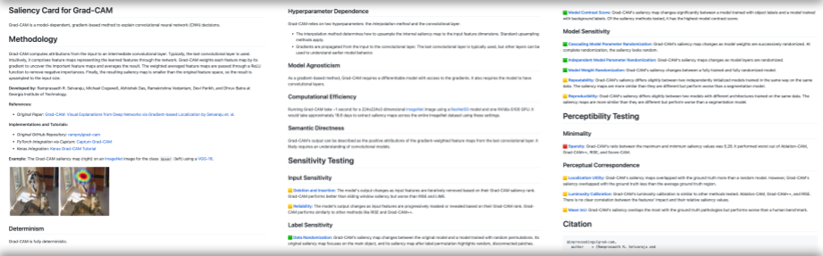

# Saliency Cards


**Saliency Cards** are transparency documentation for saliency methods. They describe essential attributes of saliency methods (e.g., their dependence on hyperparameters and sensitivity to input changes) to help users choose an appropriate method for their task.

This repo contains a [saliency card template](https://github.com/mitvis/saliency-cards/blob/main/saliency_cards/saliency_card_template.md) and [saliency cards for existing saliency methods](https://github.com/mitvis/saliency-cards/tree/main/saliency_cards). Use saliency cards to analyze and compare saliency methods!

Saliency cards are living artifacts that will evolve to support the rapid growth of saliency method research. This repository is designed as a centralized location for saliency method documentation. As new saliency methods and evaluation techniques are developed, saliency cards can be added and updated.

*We accept pull requests!*

## Exploring Saliency Methods
To explore saliency cards for existing saliency methods, see currently documented methods in `saliency_cards`. Each saliency method's card is in `{saliency_method}/{saliency_method)_saliency_card.md`. We currently have saliency cards for:
* Vanilla Gradients
* Integrated Gradients
* Grad-CAM
* SmoothGrad
* XRAI
* LIME

To learn more about the attributes used to describe saliency methods, see the [Saliency Cards paper](https://arxiv.org/abs/2206.02958) and examples of the attributes in `attribute_examples/`.

## Contributing New Saliency Cards
If you have developed a new saliency method or want to contribute a saliency card for an existing saliency method, please copy the `saliency_cards/saliency_card_template.md` and fill out each appropriate section. Name the saliency card `saliency_cards/{method name]}_saliency_card.md` and store it in its own folder in `saliency_cards/`.

## Contributing New Evaluations
If you have new evaluation metrics or the results of existing evaluations on untested saliency methods, add the metric and a short summary to the appropriate section of `saliency_cards/saliency_card_template.md`. Add the evaluation results to the saliency cards of any methods you evaluated.

## Updating The Saliency Card Framework
We expect saliency cards to change as more saliency methods are documented and evaluated. If you have ideas for better ways to categorize saliency methods, such as new attributes or different categorizations, let's discuss them! Open an issue, describe your suggestion and reasoning, and tag it with `saliency card framework`.

## Citation
For more information about saliency cards, check out [Saliency Cards: A Framework to Characterize and Compare Saliency Methods](https://arxiv.org/abs/2206.02958).

```
@inproceedings{saliencycards,
  title={{Saliency Cards: A Framework to Characterize and Compare Saliency Methods}},
  author={Boggust, Angie and Suresh, Harini and Strobelt, Hendrik and Guttag, John V and Satyanarayan, Arvind},
  booktitle = {ACM Conference on Fairness, Accountability, and Transparency (FAccT)},
  year={2023}
}
```
