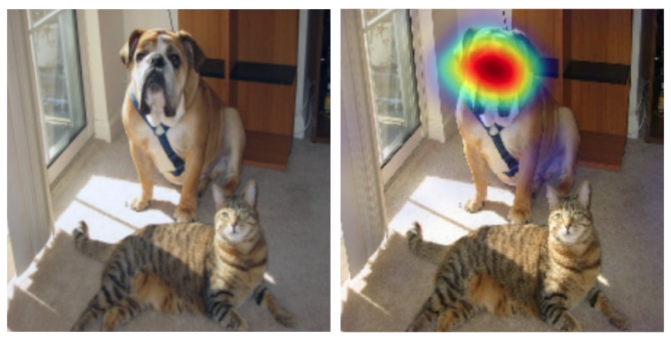

# Saliency Card for **Grad-CAM**
Grad-CAM is a model-dependent, gradient-based method to explain convolutional neural network (CNN) decisions.

# Methodology
Grad-CAM computes attributions from the input to an intermediate convolutional layer. Typically, the last convolutional layer is used. Intuitively, it comprises feature maps representing the learned features through the network. Grad-CAM weights each feature map by its gradient to uncover the important feature maps and averages the result. The weighted averaged feature maps are passed through a ReLU function to remove negative importances. Finally, the resulting saliency map is smaller than the original feature space, so the result is upsampled to the input size.

**Developed by:** Ramprasaath R. Selvaraju, Michael Cogswell, Abhishek Das, Ramakrishna Vedantam, Devi Parikh, and Dhruv Batra at Georgia Institute of Technology.

**References:** 
- *Original Paper*: [Grad-CAM: Visual Explanations from Deep Networks via Gradient-based Localization by Selvaraju et. al.](https://arxiv.org/pdf/1610.02391.pdf)

**Implementations and Tutorials:**
- *Original GitHub Repository*: [ramprs/grad-cam](https://github.com/ramprs/grad-cam/)
- *PyTorch Integration via Captum*: [Captum Grad-CAM](https://captum.ai/api/layer.html#gradcam)
- *Keras Integration*: [Keras Grad-CAM Tutorial](https://keras.io/examples/vision/grad_cam/)

**Example:** The Grad-CAM saliency map (right) on an [ImageNet](https://www.image-net.org/) image for the class `boxer` (left) using a [VGG-16](https://arxiv.org/pdf/1409.1556.pdf).



## Determinism
Grad-CAM is fully deterministic.

## Hyperparameter Dependence
Grad-CAM relies on two hyperparameters: the *interpolation method* and the *convolutional layer*.
* The interpolation method determines how to upsample the internal saliency map to the input feature dimensions. Standard upsampling methods apply.
* Gradients are propagated from the input to the convolutional layer. The last convolutional layer is typically used, but other layers can be used to understand earlier model behavior.

## Model Agnosticism
As a gradient-based method, Grad-CAM requires a differentiable model with access to the gradients. It also requires the model to have convolutional layers.

## Computational Efficiency
Running Grad-CAM take ~1 second for a 224x224x3 dimensional [ImageNet](https://www.image-net.org/) image using a [ResNet50](https://arxiv.org/abs/1512.03385) model and one NVidia G100 GPU. It would take approximately 16.6 days to extract saliency maps across the entire ImageNet dataset using these settings.

## Semantic Directness
Grad-CAM's output can be described as the positive attributions of the gradient-weighted feature maps from the last convolutional layer. It likely requires an understanding of convolutional models.

# Sensitivity Testing

## Input Sensitivity

&#129000; **[Deletion and Insertion](https://arxiv.org/pdf/1806.07421.pdf)**: The model's output changes as input features are iteratively removed based on their Grad-CAM saliency rank. Grad-CAM performs better than sliding window saliency but worse than RISE and LIME.

&#129000; **[Reliability](https://download.arxiv.org/pdf/2201.13291v3.pdf)**: The model's output changes as input features are progressively masked or revealed based on their Grad-CAM rank. Grad-CAM performs similarly to other methods like RISE and Grad-CAM++.

## Label Sensitivity

&#129001; **[Data Randomization](https://arxiv.org/pdf/1810.03292.pdf)**: Grad-CAM's saliency map changes between the original model and a model trained with random permutations. Its original saliency map focuses on the main object, and its saliency map after label permutation highlights random, disconnected patches.

&#129001; **[Model Contrast Score](https://arxiv.org/pdf/1907.09701.pdf)**: Grad-CAM's saliency map changes significantly between a model trained with object labels and a model trained with background labels. Of the saliency methods tested, it has the highest model contrast score.

## Model Sensitivity

&#129001; **[Cascading Model Parameter Randomization](https://arxiv.org/pdf/1810.03292.pdf)**: Grad-CAM's saliency map changes as model weights are successively randomized. At complete randomization, the saliency looks random.

&#129001; **[Independent Model Parameter Randomization](https://arxiv.org/pdf/1810.03292.pdf)**: Grad-CAM's saliency maps changes as model layers are randomized.

&#129001; **[Model Weight Randomization](https://pubs.rsna.org/doi/10.1148/ryai.2021200267)**: Grad-CAM's saliency changes between a fully trained and fully randomized model.

&#129000; **[Repeatability](https://pubs.rsna.org/doi/10.1148/ryai.2021200267)**: Grad-CAM's saliency differs slightly between two independently initialized models trained in the same way on the same data. The saliency maps are more similar than they are different but perform worse than a segmentation model.

&#129000; **[Reproducibility](https://pubs.rsna.org/doi/10.1148/ryai.2021200267)**: Grad-CAM's saliency differs slightly between two models with different architectures trained on the same data. The saliency maps are more similar than they are different but perform worse than a segmentation model.

# Perceptibility Testing

## Minimality

&#128997; **[Sparsity](https://download.arxiv.org/pdf/2201.13291v3.pdf)**: Grad-CAM's ratio between the maximum and minimum saliency values was 5.28. It performed worst out of Ablation-CAM, Grad-CAM++, RISE, and Score-CAM.

## Perceptual Correspondence

&#129000; **[Localization Utility](https://pubs.rsna.org/doi/10.1148/ryai.2021200267)**: Grad-CAM's saliency maps overlapped with the ground truth more than a random model. However, Grad-CAM's saliency overlapped with the ground truth less than the average ground truth region.

&#129000; **[Luminosity Calibration](https://download.arxiv.org/pdf/2201.13291v3.pdf)**: Grad-CAM's luminosity calibration is similar to other methods tested: Ablation CAM, Grad-CAM++, and RISE. There is no clear correlation between the features' impact and their relative saliency values.

&#129000; **[Mean IoU](https://www.nature.com/articles/s42256-022-00536-x)**: Grad-CAM's saliency overlaps the most with the ground truth pathologies but performs worse than a human benchmark.


# Citation

```
@inproceedings{grad-cam,
  author    = {Ramprasaath R. Selvaraju and
               Michael Cogswell and
               Abhishek Das and
               Ramakrishna Vedantam and
               Devi Parikh and
               Dhruv Batra},
  title     = {Grad-CAM: Visual Explanations from Deep Networks via Gradient-Based Localization},
  booktitle = {International Conference on Computer Vision,({ICCV})},
  pages     = {618--626},
  publisher = {{IEEE} Computer Society},
  year      = {2017},
}
```
