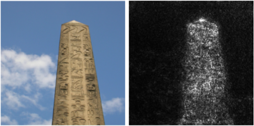

# SmoothGrad Saliency Card
SmoothGrad is a saliency method extension.

## Methodology
SmoothGrad reduces the noise in saliency maps by averaging the saliency of an image and the saliency of perturbations of the image.

**Developed by:** Daniel Smilkov, Nikhil Thorat, Been Kim, Fernanda Viégas, and Martin Wattenberg at Google

**References:**
- *Original Paper*: [SmoothGrad: removing noise by adding noise
](https://arxiv.org/abs/1706.03825)
- *Blog Post*: [Google PAIR Blog on SmoothGrad](https://pair-code.github.io/saliency/#smoothgrad)

**Implementations and Tutorials [optional]:**
- [Google PAIR implemenation](https://github.com/pair-code/saliency)
- [Captum implemenation](https://captum.ai/api/noise_tunnel.html)

**Example:** The SmoothGrad saliency map (right) on an [ImageNet](https://www.image-net.org/) image for the class `obelisk` (left) using a [Inception v3](https://arxiv.org/pdf/1512.00567.pdf). This example is from the [Google PAIR Blog on SmoothGrad](https://pair-code.github.io/saliency/#smoothgrad).



### Determinism
SmoothGrad applies non-deterministic perturbations to the inputs. It also inherits the any non-determinism from its underlying saliency method.

### Hyperparameter Dependence
SmoothGrad relies on its underlying saliency method, the perturbation parameters, and the number of perturbed inputs to average over. SmoothGrad can be applied to any saliency method and is commonly applied to vanilla gradients, input x gradient, integrated gradients, and guided backpropagation. It typically perturbs inputs using Gaussian noise.

### Model Agnosticism
SmoothGrad is applicable to any saliency method and inherits its model agnosticism.

### Computational Efficiency
Computing SmoothGrad add approximately a 20x time increase using the [Captum implementation](https://captum.ai/api/integrated_gradients.html) with its default parameters on a 224x224x3 dimensional ImageNet image, ResNet50 model, and one NVidia G100 GPU.

### Semantic Directness
SmoothGrad represents the average saliency across noisy versions of the input. Its semantic directness solely depends on the semantic directness of its underlying saliency method.

## Sensitivity Testing

### Input Sensitivity

&#128994; **[Infidelity](https://arxiv.org/pdf/1901.09392.pdf)**: SmoothGrad increases a saliency method's infidelity. Evaluated on MNIST, CIFAR-10, and ImageNet using vanilla gradients, integrated gradients, and guided backpropagation.

&#129000; **[Input Consistency](https://arxiv.org/pdf/2104.05824.pdf)**: SmoothGrad's input consistency is inconclusive. It was more consistent than vanilla gradients and integrated gradients using a transformer model, but less or similarly consistent using LSTM and QRNN models. Evaluated using number and gender agreement feature swaps with the Syneval and Winobias datasets.

&#129000; **[Input Invariance](https://arxiv.org/pdf/1711.00867.pdf)**: SmoothGrad inherits the input invariance of the underlying saliency method. It satisfies input invariance when applied to vanilla gradients or guided backpropagation, but does not satisfy input invariance when applied to integrated gradients, input x gradient, and deep taylor decomposition. Evaluated using a CNN on MNIST.

&#129000; **[ROAR](https://proceedings.neurips.cc/paper/2019/file/fe4b8556000d0f0cae99daa5c5c5a410-Paper.pdf)**: Original SmoothGrad performs worse than or on par with its underlying method. However, variants of SmoothGrad (SmoothGrad Squared and VarGrad) outperform all other methods and far outperform random. Evaluated using ImageNet, Food 101, and Birdsnap.

&#128994; **[Sensitivity](https://arxiv.org/pdf/1901.09392.pdf)**: SmoothGrad increases a saliency method's sensitivity. Evaluated on MNIST, CIFAR-10, and ImageNet using vanilla gradients, integrated gradients, and guided backpropagation.


### Label Sensitivity

&#129000; **[Data Randomization](https://arxiv.org/pdf/1810.03292.pdf)**: SmoothGrad will pass/fail the data randomization test based on its underlying saliency method. Evaluated on MNIST and Fashion MNIST.

&#128994; **[Model Contrast Score](https://arxiv.org/pdf/1907.09701.pdf)**: SmoothGrad improves the model contrast score of its underlying method. Evaluated on the BAM dataset using vanilla gradients and integrated gradients.

### Model Sensitivity

&#129000; **[Cascading Model Parameter Randomization](https://arxiv.org/pdf/1810.03292.pdf)**: SmoothGrad will pass/fail the data randomization test based on its underlying saliency method. Evaluated on MNIST and Fashion MNIST.

&#129000; **[Independent Model Parameter Randomization](https://arxiv.org/pdf/1810.03292.pdf)**: SmoothGrad will pass/fail the data randomization test based on its underlying saliency method. Evaluated on MNIST and Fashion MNIST.

&#129000; **[Model Consistency](https://arxiv.org/pdf/2104.05824.pdf)**: SmoothGrad's model consistency is inconclusive. It was more consistent than vanilla gradients and integrated gradients using a transformer model, but less or similarly consistent using LSTM and QRNN models. Evaluated using number and gender agreement feature swaps with the Syneval and Winobias datasets.

&#128994; **[Model Weight Randomization](https://pubs.rsna.org/doi/10.1148/ryai.2021200267)**: On a randomized model, SmoothGrad applied to vanilla gradients and integrated gradients saliency is random. Evaluated on SIIM-ACR Pneumothorax and RSNA Pneumonia medical images.

&#128997; **[Repeatability](https://pubs.rsna.org/doi/10.1148/ryai.2021200267)**: SmoothGrad does not improve the repeatability of vanilla gradients and integrated gradients and does not pass the baseline. Evaluated on SIIM-ACR Pneumothorax and RSNA Pneumonia medical images.

&#128997; **[Reproducibility](https://pubs.rsna.org/doi/10.1148/ryai.2021200267)**: SmoothGrad does not significantly improve the reproducibility of vanilla gradients and integrated gradients and does not pass the baseline. Evaluated on SIIM-ACR Pneumothorax and RSNA Pneumonia medical images.

## Perceptibility Testing

### Minimality

&#128994; **[Visual Sharpening](https://arxiv.org/pdf/1706.03825.pdf)**: SmoothGrad improves visual sharpening by removing visual noise through averaging. 

### Perceptual Correspondence

&#128997; **[Localization Utility](https://pubs.rsna.org/doi/10.1148/ryai.2021200267)**: SmoothGrad does not significantly improve the localization utility of vanilla gradients and integrated gradients and does not pass the baseline. Evaluated on SIIM-ACR Pneumothorax and RSNA Pneumonia medical images.

&#128994; **[Plausibility](https://arxiv.org/pdf/2104.05824.pdf)**: SmoothGrad outperforms the random baseline and vanilla gradients across almost all models and tasks. It outperforms integrated gradients on transformer models. Evaluated on number and gender agreement tasks using the Syneval and Winobias datasets.


## Citation

**BibTeX:**
```
@article{smoothgrad,
    title={{SmoothGrad}: {R}emoving noise by adding noise},
    author={Smilkov, Daniel and Thorat, Nikhil and Kim, Been and Vi{\'e}gas, Fernanda and Wattenberg, Martin},
    journal={arXiv preprint arXiv:1706.03825},
    year={2017}
}
```

