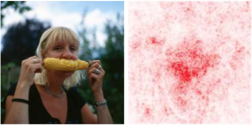

# Vanilla Gradients Saliency Card
Vanilla gradients is a simple model-dependent, gradient-based saliency method.

## Methodology
Vanilla gradients computes saliency as the gradient of the model's output with respect to the input. This measures how much a small change to an input feature impacts the model's output. If changing the feature greatly impacts the model's output, then that feature is important to the model.

**References:**
- *Original Paper 1*: [Deep Inside Convolutional Networks: Visualising Image Classification Models and Saliency Maps](https://arxiv.org/abs/1312.6034)
- *Original Paper 2*: [Visualizing Higher-Layer Features of a Deep Network](https://www.researchgate.net/profile/Aaron-Courville/publication/265022827_Visualizing_Higher-Layer_Features_of_a_Deep_Network/links/53ff82b00cf24c81027da530/Visualizing-Higher-Layer-Features-of-a-Deep-Network.pdf)

**Implementations and Tutorials:**
- [Captum Implementation](https://captum.ai/api/saliency.html)

**Aliases:** gradients, saliency, vanilla saliency

**Example:** The vanilla gradients saliency map (right) on an [ImageNet](https://www.image-net.org/) image for the class `corn` (left) using a [Inception v3](https://arxiv.org/pdf/1512.00567.pdf). This example is from [Sanity Checks for Saliency Maps](https://arxiv.org/pdf/1810.03292.pdf).



### Determinism
Vanilla gradients is deterministic.

### Hyperparameter Dependence
Vanilla gradients does not have any hyperparameters.

### Model Agnosticism
Vanilla gradients requires a differentiable model with access to the gradients.

### Computational Efficiency
Computing vanilla gradients takes on the order of $1\mathrm{e}{-2}$ seconds using the [Captum implementation](https://captum.ai/api/saliency.html) on a 224x224x3 dimensional [ImageNet](https://www.image-net.org/) image, [ResNet50](https://arxiv.org/abs/1512.03385) model, and one NVidia G100 GPU.

### Semantic Directness
Vanilla gradients saliency represents the magnitude of the change in the model’s output given a small change to an input feature.

## Sensitivity Testing

### Input Sensitivity

&#129000; **[Infidelity](https://arxiv.org/pdf/1901.09392.pdf)**: Vanilla gradients' infidelity is inconclusive. It generally performs worse than SHAP, integrated gradients, and smoothed saliency methods and performs on par with guided backpropagation across MNIST, ImageNet, and CIFAR-10.

&#129000; **[Input Consistency](https://arxiv.org/pdf/2104.05824.pdf)**: Vanilla gradients' input consistency is inconclusive. It was more consistent than SmoothGrad using QRNN models, similar to SmoothGrad using an LSTM model, and less consistent than integrated gradients across LSTM, QRNN, and transformer models. Evaluated using number and gender agreement feature swaps with the Syneval and Winobias datasets.

&#128994; **[Input Invariance](https://arxiv.org/pdf/1711.00867.pdf)**: Vanilla gradients passes the input invariance test. It produces identical saliency maps for two MNIST models with different constant input shifts. It computes saliency based on the model's function, so it will always be input invariant for models with identical weights. 

&#129000; **[Perturbation Testing (LeRF)](http://www.interpretable-ml.org/nips2017workshop/papers/02.pdf)**: Vanilla gradients' LeRF perturbation tests were inconclusive. It performed better than random across all evaluations (MNIST, CIFAR-10, ImageNet, and IMDB datasets with MLP, CNN, Inception v3, and LSTM models) but worse than all other methods. Since it discards the sign information, it considers features that negatively impact the model equally important to features that positively affect the model, so features with a significant negative contribution are not removed until late in the LeRF process.

&#129000; **[Perturbation Testing (MoRF)](http://www.interpretable-ml.org/nips2017workshop/papers/02.pdf)**: Vanilla gradients' MoRF perturbation tests were inconclusive. It performed better than random across all evaluations (MNIST, CIFAR-10, ImageNet, and IMDB datasets with MLP, CNN, Inception v3, and LSTM models) but worse than all other methods. Since it discards the sign information, it considers features that negatively impact the model equally important to features that positively affect the model, so features with a significant negative contribution are added early in the MoRF process.

&#128997; **[ROAR](https://proceedings.neurips.cc/paper/2019/file/fe4b8556000d0f0cae99daa5c5c5a410-Paper.pdf)**: Vanilla gradients fails the ROAR test. It performs worse than random saliency when applied to an ImageNet ResNet50.

&#129000; **[Robustness](https://arxiv.org/pdf/1806.08049.pdf)**: Vanilla gradients is somewhat sensitive to random noise, which causes slight changes to the saliency despite little change to the model's output. Evaluated using an MNIST CNN.

&#129000; **[Sensitivity](https://arxiv.org/pdf/1901.09392.pdf)**: Vanilla gradients' sensitivity is inconclusive. It generally performs worse than SHAP, integrated gradients, and smoothed saliency methods and performs on par with guided backpropagation across MNIST, ImageNet, and CIFAR-10.

&#128994; **[Stability](https://arxiv.org/pdf/1806.07538.pdf)**: Vanilla gradients is relatively stable, and its outputs change minimally in response to adversarial perturbations. It performs better than LIME and equivalently to integrated gradients, input x gradients, LRP, and Occlusion. Evaluated on MNIST.

### Label Sensitivity

&#128994; **[Data Randomization](https://arxiv.org/pdf/1810.03292.pdf)**: Vanilla gradients changes appropriately as the model is progressively randomized. Evaluated on MNIST and Fashion MNIST.

&#129000; **[Model Contrast Score](https://arxiv.org/pdf/1907.09701.pdf)**: Vanilla gradients achieves a better-than-random model contrast score but performs worse than Grad-CAM and SmoothGrad. Evaluated on the BAM image dataset.

### Model Sensitivity

&#128994; **[Cascading Model Parameter Randomization](https://arxiv.org/pdf/1810.03292.pdf)**: Vanilla gradients changes appropriately as the model is progressively randomized. Evaluated an ImageNet Inception V3.

&#128994; **[Implementation Invariance](https://arxiv.org/pdf/1703.01365.pdf)**: Vanilla gradients algorithmically guarantees implementation invariance. It will produce equivalent saliency for functionally equivalent models.

&#128994; **[Independent Model Parameter Randomization](https://arxiv.org/pdf/1810.03292.pdf)**: Vanilla gradients changes appropriately as the model layers are independently randomized. Evaluated an ImageNet Inception V3.

&#129000; **[Model Consistency](https://arxiv.org/pdf/2104.05824.pdf)**: Vanilla gradients' model consistency is inconclusive. In response to model compression, its saliency stayed more consistent than SmoothGrad on a QRNN model, similarly consistent to SmoothGrad on a LSTM model, and less consistent than SmoothGrad on a transformer model and integrated gradients on all three models. Evaluated using DistillBert distillation and number and gender agreement tasks on the Syneval and Winobias datasets.

&#128994; **[Model Weight Randomization](https://pubs.rsna.org/doi/10.1148/ryai.2021200267)**: On a randomized model, vanilla gradients saliency is random. Evaluated on SIIM-ACR Pneumothorax and RSNA Pneumonia medical images.

&#128997; **[Repeatability](https://pubs.rsna.org/doi/10.1148/ryai.2021200267)**: Vanilla gradients fails repeatability. Its saliency values for two models trained in the same way are more dissimilar than similar. Evaluated on SIIM-ACR Pneumothorax and RSNA Pneumonia medical images.

&#128997; **[Reproducibility](https://pubs.rsna.org/doi/10.1148/ryai.2021200267)**: Vanilla gradients fails reproducibility. Its saliency values for two different architectures trained in the same way are more dissimilar than similar. Evaluated using Inception V3 and DenseNet-121 on SIIM-ACR Pneumothorax and RSNA Pneumonia medical images.

## Perceptibility Testing

### Minimality

&#128997; **[Visual Sharpening](https://arxiv.org/pdf/1706.03825.pdf)**: 
Vanilla gradients appear noisy and are less visually coherent than Guided Backpropagation and SmoothGrad saliency methods. Evaluated on an ImageNet Inception V3 and MNIST CNN.

### Perceptual Correspondence

&#128997; **[Localization Utility](https://pubs.rsna.org/doi/10.1148/ryai.2021200267)**: Vanilla gradients fails localization utility. Its saliency values overlap less with the ground truth than a random model. Evaluated on SIIM-ACR Pneumothorax and RSNA Pneumonia medical images.

&#129000; **[Plausibility](https://arxiv.org/pdf/2104.05824.pdf)**: Vanilla gradients plausibility tests are inconclusive. It highlights human-important features more often than random for transformer and QRNN models, but performs worse than random for LSTM models and worse than integrated gradients and SmoothGrad across the majority of settings. Evaluated on number and gender agreement tasks using the Syneval and Winobias datasets.

&#128994; **[The Pointing Game](https://arxiv.org/pdf/1608.00507.pdf)**: Vanilla gradients highest saliency value is in the set of ground truth features more than other the baseline center feature, Deconvnet, LRP, and CAM. Evaluated on VOC07 and COCO using CNN, VGG16, and GoogleNet models.


## Citation

**BibTeX:**
```
@inproceedings{vanillagradients1,
    title={Deep Inside Convolutional Networks: {V}isualising Image Classification Models and Saliency Maps},
    author={Simonyan, Karen and Vedaldi, Andrea and Zisserman, Andrew},
    booktitle = {Proceedings of the International Conference on Learning Representations ({ICLR}), Workshop Track},
    year={2014},
}

@article{vanillagradients2,
    author = {Erhan, Dumitru and Bengio, Y. and Courville, Aaron and Vincent, Pascal},
    year = {2009},
    title = {Visualizing Higher-Layer Features of a Deep Network},
    journal = {Technical Report, Univeristé de Montréal},
}
```

