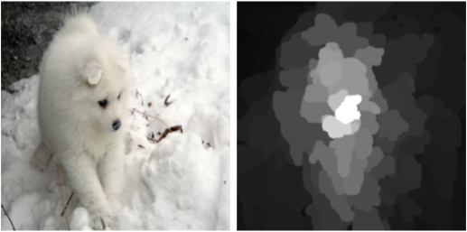

# XRAI Saliency Card
XRAI is a region-based saliency method extension.

## Methodology
XRAI converts feature-based saliency methods into region-based saliency. It over-segments the input into many regions, computes saliency using another saliency method (e.g., integrated gradients and guided integrated gradients), and sums the saliency within each region.

**Developed by:** Andrei Kapishnikov, Tolga Bolukbasi, Fernanda Viégas, Michael Terry at Google.

**References:**
- *Original Paper*: [XRAI: Better Attributions Through Regions](https://arxiv.org/pdf/1906.02825.pdf)
- *Blog Post*: [Google PAIR Blog on XRAI](https://pair-code.github.io/saliency/#xrai)

**Implementations and Tutorials:**
- [Google PAIR Implementation](https://github.com/pair-code/saliency)

**Example:** The vanilla gradients saliency map (right) on an [ImageNet](https://www.image-net.org/) image for the class `samoyed` (left) using a [Inception v3](https://arxiv.org/pdf/1512.00567.pdf). This example is from [XRAI: Better Attributions Through Regions](https://arxiv.org/pdf/1906.02825.pdf).



### Determinism
XRAI is deterministic unless using a non-deterministic saliency method or segmentation method.

### Hyperparameter Dependence
XRAI relies on a choice of `saliency method` and `segmentation method`.
It inherits the hyperparameter dependence of its `saliency method` (integrated gradients and guided integrated gradients are used in the original paper). The regions will depend on the `segmentation method` and its parameters (the original paper uses Felzenszwalb image segmentation).

### Model Agnosticism
XRAI requires input features that can be meaningfully segmented. It inherits the model agnosticism of its underlying saliency method.

### Computational Efficiency
Computing XRAI takes on the order of $1\mathrm{e}{1}$ seconds using the [Captum implementation](https://captum.ai/api/saliency.html) on a 224x224x3 dimensional [ImageNet](https://www.image-net.org/) image, [ResNet50](https://arxiv.org/abs/1512.03385) model, and one NVidia G100 GPU.

### Semantic Directness
XRAI represents the importance of input regions. Its semantic directness depends on the semantic directness of its underlying saliency method.

## Sensitivity Testing

### Input Sensitivity

### Label Sensitivity

### Model Sensitivity

&#128997; **[Model Weight Randomization](https://pubs.rsna.org/doi/10.1148/ryai.2021200267)**: XRAI did not reach randomization even on a fully randomized model. Evaluated on SIIM-ACR Pneumothorax and RSNA Pneumonia medical images.

&#128994; **[Repeatability](https://pubs.rsna.org/doi/10.1148/ryai.2021200267)**: XRAI has the highest repeatability across saliency methods (vanilla gradients, integrated gradients, SmoothGrad, Grad-CAM, guided backpropagation, and guided Grad-CAM) and outperformed the baseline. Evaluated using Inception v3 models on SIIM-ACR Pneumothorax and RSNA Pneumonia medical images.

&#128994; **[Reproducibility](https://pubs.rsna.org/doi/10.1148/ryai.2021200267)**: XRAI has the highest reproducibility across saliency methods (vanilla gradients, integrated gradients, SmoothGrad, Grad-CAM, guided backpropagation, and guided Grad-CAM). Evaluated using Inception V3 and DenseNet-121 on SIIM-ACR Pneumothorax and RSNA Pneumonia medical images.

## Perceptibility Testing

### Minimality

### Perceptual Correspondence

&#128994; **[Localization Utility](https://pubs.rsna.org/doi/10.1148/ryai.2021200267)**: XRAI passes the localization utility test. It outperformed the other saliency methods (vanilla gradients, integrated gradients, SmoothGrad, Grad-CAM, guided backpropagation, and guided Grad-CAM) and the average saliency map. Evaluated using Inception V3 and DenseNet-121 on SIIM-ACR Pneumothorax and RSNA Pneumonia medical images.

## Citation

**BibTeX:**
```
@inproceedings{xrai,
  author    = {Andrei Kapishnikov and
               Tolga Bolukbasi and
               Fernanda B. Vi{\'{e}}gas and
               Michael Terry},
  title     = {{XRAI:} {B}etter Attributions Through Regions},
  booktitle = {Proceedings of the International Conference on Computer Vision ({ICCV})},
  pages     = {4947--4956},
  publisher = {{IEEE}},
  year      = {2019},
}
```

